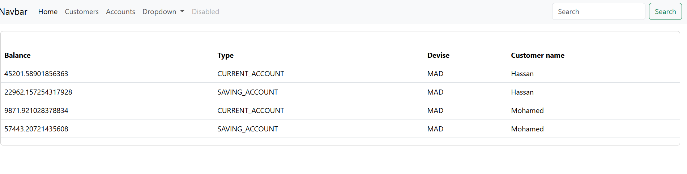

<h1>Déploiement avec Docker, Dockerfile et docker-compose</h1>
<h3>1. il faut creer les fichier Dockerfile dans chaque microservices</h3>
<pre>
    FROM openjdk:17-oracle
    #permet de conserver les données du container dans un dossiers
    VOLUME /tmp
    ARG JAR_FILE=target/*.jar
    COPY ${JAR_FILE} app.jar
    #permet d'executer la commande java -jar app.jar
    ENTRYPOINT ["java","-jar","app.jar"]
</pre>
 - Comment créer une image
   - A partir du fichier DockerFile et dans le repertoire il faut executer la commande suivante :  
   <pre>
        docker build -t NOM_IMAGE:TAG .
   </pre>  
   <pre>
        docker build -t ebank-discovery-service .
   </pre>
 - Comment lister les images
   <pre>
        docker images
   </pre>
 - Comment démarrer un container à partir d'une image
   <pre>
        docker run -p 8761:8761 --name NOM_IMAGE:TAG
   </pre>
 - Comment lister les containers démarrés
   <pre>
        docker ps
   </pre>
 - Comment arrêter un container 
   <pre>
        docker stop NOM_CONTAINER_OU_ID
   </pre>
<h3>2. Il faut creer les packages des microservices après chaque modification</h3>
<pre>
    mvn clean package -DskipTests
</pre>
<h3>3. il faut creer le fichier docker-compose.yml à la racine du projet</h3>

il faut faire attention à l'adresse IP de la machine où a été installé docker pour le déploiement

<pre>
    services:
      ebank-discovery-service:
        # rechercher le fichier Dockerfile dans le repertoire discovery-service 
        build: ./discovery-service
        container_name: ebank-discovery-service
        ports:
          - "8761:8761"
        expose:
          - '8761'
        healthcheck: #tester si le microservice est toujours démarré
          test: ["CMD", "curl", "-f", "http://192.168.1.78:8761/actuator/health"]
          interval: 20s
          timeout: 10s
          retries: 6
      ebank-config-service:
        build: ./config-service
        container_name: ebank-config-service
        ports:
          - "9999:9999"
        expose:
          - '9999'
        environment:
          - DISCOVERY_SERVICE_URL=http://ebank-discovery-service:8761/eureka
        healthcheck:
          test: ["CMD", "curl", "-f", "http://192.168.1.78:9999/actuator/health"]
          interval: 25s
          timeout: 20s
          retries: 7
        depends_on:
          ebank-discovery-service:
            condition: service_healthy
      customer-service:
        build: ./customer-service
        container_name: customer-service
        ports:
          - "8082:8082"
        expose:
          - '8082'
        environment:
          - DISCOVERY_SERVICE_URL=http://ebank-discovery-service:8761/eureka
          - CONFIG_SERVICE_URL=http://ebank-config-service:9999
        healthcheck:
          test: [ "CMD", "curl", "-f", "http://192.168.1.78:8082/actuator/health" ]
          interval: 25s
          timeout: 10s
          retries: 6
        depends_on:
          ebank-config-service:
            condition: service_healthy
      account-service:
        build: ./account-service
        container_name: account-service
        ports:
          - "8083:8083"
        expose:
          - '8083'
        environment:
          - DISCOVERY_SERVICE_URL=http://ebank-discovery-service:8761/eureka
          - CONFIG_SERVICE_URL=http://ebank-config-service:9999
        depends_on:
          customer-service:
            condition: service_healthy
      gateway-service:
        build: ./gateway-service
        container_name: gateway-service
        ports:
          - "8888:8888"
        expose:
          - '8888'
        environment:
          - DISCOVERY_SERVICE_URL=http://ebank-discovery-service:8761/eureka
          - CONFIG_SERVICE_URL=http://ebank-config-service:9999
        depends_on:
          ebank-discovery-service:
            condition: service_healthy
</pre>
<h3>4. Il faut lancer les conteneurs en forçant les build et en le démarrant en arrière plan afin de consulter facilement les conteneurs qui ont démarré</h3>
<pre>
    docker compose up -d --build
</pre>

<h3>5. Vérification </h3>

<h3>6. En cas d'erreur il faut consulter les logs</h3>
<pre>
    docker logs [NOM_CONTAINER_ou_ID]
</pre>
<h3>6. Arreter les containers</h3>
<pre>
    docker compose down
</pre>
<h3>7. Pour éviter les problèmes de cors origin il faut configurer le fichier application.yml de la gateway</h3>
<pre >
    spring:
      cloud:
        gateway:
          globalcors:
            corsConfigurations:
              '[/**]':
                allowedOrigins: "http://localhost:4200"
                allowedHeaders: "*"
                allowedMethods:
                  - GET
                  - POST
                  - PUT
                  - DELETE
</pre>
<h3>8. Affichage de la liste des customers</h3>

h3>9. Affichage de la liste des comptes</h3>

<h3>10. il faut créer le fichier Dockerfile du front</h3>
<pre>
   FROM node:latest as build
   WORKDIR /usr/local/app/
   COPY ./ /usr/local/app/
   RUN npm install
   RUN npm run build --prod
   
   FROM nginx:latest
   COPY --from=build /usr/local/app/dist/angular-front-end/browser /usr/share/nginx/html
   
   EXPOSE 80
</pre>
<h3>11. il faut créer l'image</h3>
<pre>
    docker build . -t angular-cust-app
</pre>
<h3>12. il faut démarrer le container</h3>
<pre>
    docker run -d -p 80:80 angular-cust-app
</pre>
<h3>13. il faut ajouter le service angular-cust-app à docker-compose</h3>
<pre>
  angular-cust-app:
    build: ./angular-front-end
    container_name: angular-cust-app
    ports:
      - "80:80"
    expose:
      - '80'
    depends_on:
      gateway-service:
        condition: service_healthy
</pre>
 - Pour déployer une application en ligne sur un serveur dédié
   - il faut installer docker sur le serveur
   - il faut récupérer l'adresse IP du serveur
   - aller dans les variables d'environnement modifier l'adresse IP DOKER_HOST par l'adresse IP du serveur
   - Ensuite, sur le serveur il faut modifier le fichier de configuration de docker
   <pre>
      nano /lib/systemd/system/docker.service
   </pre>
   - Aller à la liste ou se trouver le commantaire avant // 0.0.0.0:2375 et decommenté en supprimant les //
   - il faut maintenant redémarrer le docker agent
   <pre>
      systemctl daemon-reload
      sudo service docker restart
   </pre>
   - comment vérifier que docker écoute toujours sur le port 2375
    <pre>
        http://localhost_ou_adresse_IP:2375/images/json
    </pre>
   - Sur le serveur il ne faut pas oublier de modifier le port par défaut de docker et ajouter un mot de passe à docker
   - si tu ajoute une base de données mysql il ne faut pas oublier de mapper les volumes au démarrage afin de rendre persistantes les données
   de la base de données. Tu peux utiliser la commande suivante pour mapper les volumes :
   <pre>
      docker run -v /opt/mysqlData:/var/lib/mysql -e MYSQL_ROOT_PASSWORD=motdepasse mysql
   </pre>
   - faire les mêmes étapes que pour le déploiement local
